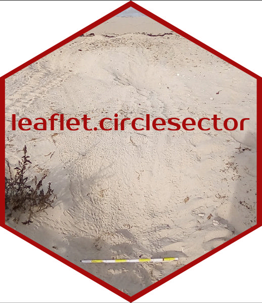
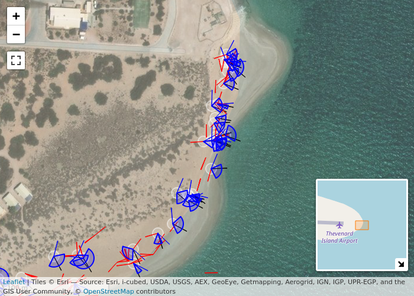

<!-- README.md is generated from README.Rmd. Please edit that file -->

# `leaflet.circlesector`: An R wrapper for the Leaflet.Circle-sector plugin 

<!-- badges: start -->

[](https://github.com/dbca-wa/leaflet.circlesector/actions)
<!-- badges: end -->

The R package `leaflet.circlesector` wraps the Leaflet plugin
[Leaflet.Circle-sector](https://github.com/kluizeberg/Leaflet.Circle-sector),
providing a way to draw circle segments on leaflet maps.

This can be used to visualise marine turtle hatchling (mis)orientation
at the time of nest emergence.

See
[`vignette("Introduction")`](https://dbca-wa.github.io/leaflet.circlesector/articles/intro.html)
for an explanation of packaged example data and desired visualisation.

``` r
library(leaflet.circlesector)
data("fans_tracks")
data("fans_mean")
data("fans_water")
data("outlier_segments")

leaflet_basemap(l_height = 500, l_width = 700) %>% 
    leaflet::clearBounds() %>% 
    leaflet::addCircles(
        data = fans_tracks,
        lat = ~ lat,
        lng = ~ lon,
        color = 'white',
        weight = 2,
        radius = 5
    ) %>%
    addCircleSectorMid(data = fans_mean) %>%
    addCircleSectorMid(data = fans_water) %>%
    addCircleSectorMid(data = outlier_segments) %>%
    addCircleSectorMinMax(data = fans_tracks) %>% 
    leaflet::setView(115.0245, -21.46, 19)
```



## Installation

You can install the development version of `leaflet.circlesector` from
[GitHub](https://github.com/) with:

``` r
# install.packages("remotes")
remotes::install_github("dbca-wa/leaflet.circlesector")
```
